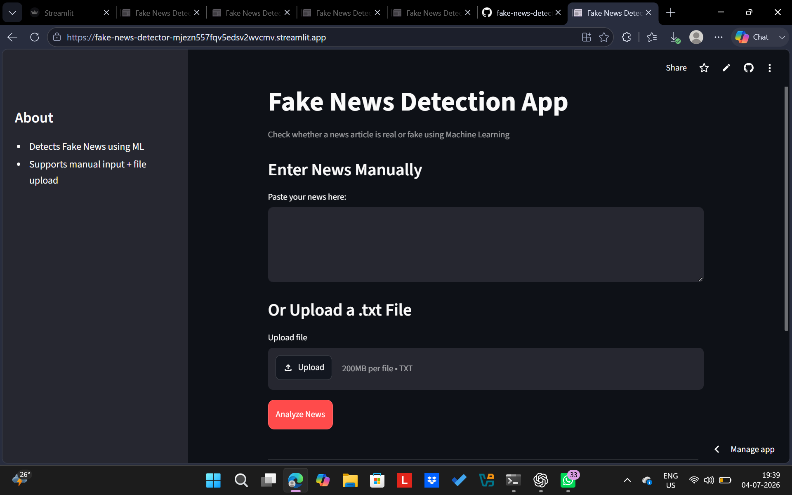

# fake-news-detector
# Fake News Detection App

A Machine Learning web application that classifies news articles as **Real or Fake** using Natural Language Processing (NLP).

##  Live Demo
 https://fake-news-detector-mjezn557fqv5edsv2wvcmv.streamlit.app/

##  Features
-  Detects fake vs real news
-  Displays confidence score
-  Supports CSV file upload
-  Fully deployed web application

##  Tech Stack
- Python
- Scikit-learn
- Pandas, NumPy
- TF-IDF Vectorization
- Streamlit

##  How it works
1. Input news text or upload CSV
2. Text is processed using TF-IDF
3. Model predicts label (Real/Fake)
4. Confidence score is displayed

##  Model Info
- Algorithm: (write your model name here e.g. Logistic Regression)
- Dataset: Fake.csv + True.csv
- Accuracy: score

##  Screenshots

### Home Page

### Prediction Result

### File Upload

##  Author
Fatima Choudhary
